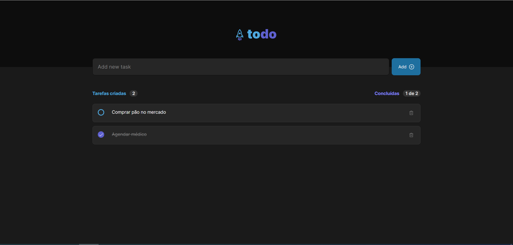

# ToDo

A website to organize yours tasks, and help you to know exactly what you do.



## How was this website made?

### What i used?

- React
- HTML
- CSS
- JavaScript
- TypeScript
- Vite

## How install

You need to have node in your computer.

First open git shell in a folder that you want to have this project.

Use this command:

```powershell
  $ git clone https://github.com/diuliano-vargas-silveira/to-do.git
```

When you have the project installed, you will need to open your shell and use this command:

```powershell
  $ npm install
```

After all this steps, you can finally run the project, use this command and you can open the project in this url "http://localhost:5173/":

```powershell
  $ npm run dev
```


